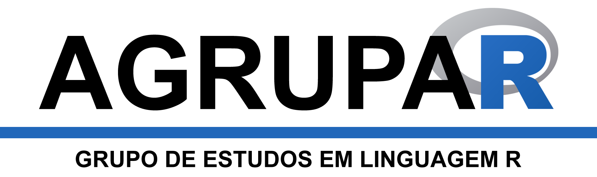

```{r global_options, include=FALSE}
library(openxlsx)
library(knitr)
library(kableExtra)
library(tidyverse)
```

```{r logo, echo=FALSE, fig.align='center', out.width="40%"}


```

#Quem somos?

O AGRUPAR – Grupo de Estudos em Linguagem R – é uma iniciativa de alunos e professores do [Programa de Pós-Graduação em Análise e Modelagem de Sistemas Ambientais (IGC/UFMG)](http://www.igc.ufmg.br/index.php?option=com_content&view=article&id=331:pos-graduacao-em-analise-e-modelagem-de-sistemas-ambientais&catid=2:uncategorised) para fomentar a discussão e o compartilhamento de conhecimentos sobre a linguagem computacional R.

Pesquisas recentes mostram que a popularidade do R tem aumentado substancialmente nos últimos anos. Esta linguagem, de código aberto, vem se tornando a língua padrão para ciência de dados, o que inclui a manipulação destes dados, análises estatísticas e geração de gráficos e relatórios.

Dada a relevância do R e a sua interface com análise e modelagem de sistemas ambientais, decidimos criar o AGRUPAR. O objetivo é termos um ambiente de discussão em diversos aspectos relacionados ao R, alguns mais, outros menos aprofundados. De qualquer maneira, a intenção é iniciar os encontros com temas mais básicos e ir aprofundando em assuntos mais complexos com o próprio desenvolvimento do grupo.

No primeiro semestre de 2018, os encontros quinzenais acontecerão às quintas-feiras, de 14 às 16 h. As duas primeiras reuniões serão realizadas na sala 334 do IGC (Sala de Convívio Social). Dependendo do número de interessados, o local poderá ser alterado, sempre com prévio aviso. O primeiro encontro, que será no dia 05/04 (confira a nossa [**agenda**](#Agenda)), terá menos ênfase em R, mas abordará um tema não menos importante: referenciamento bibliográfico automatizado em textos científicos com Mendeley Desktop.

Se você tem interesse em participar do AGRUPAR, por favor, preencha o [**cadastro**](#Cadastro). Em caso de dúvidas, mande-nos um [**e-mail**](mailto:rapdornas@gmail.com)!

Até breve!

Rubem Dornas, Fernanda Teixeira e Marina Scarpelli

***

#Cadastro {#Cadastro}

<iframe src="https://docs.google.com/forms/d/e/1FAIpQLSdbcVIKenKHUT9208tPcUz3ALcNujQ8SR4B1m31sg0kOOMB2w/viewform?embedded=true" width="480" height="250" frameborder="0" marginheight="0" marginwidth="0">Carregando…</iframe>

***

#Agenda {#Agenda}

```{r Agenda, echo=FALSE, message=FALSE, warning=FALSE}

Data <- c("05/04/2018", "19/04/2018")
Título <- c("Referenciamento bibliográfico automatizado em textos científicos com Mendeley Desktop", "Fundamentos básicos de RStudio e estrutura de dados em linguagem R")
Local <- c("IGC", "IGC")
Sala <- c(334, 334)

df <- as.tibble(cbind.data.frame(Data, Título, Local, Sala))

kable(df, format = "html", row.names = T, escape = F) %>% 
  kable_styling(position = "center", latex_options = "striped") %>% 
    row_spec(0, bold = T)
```

